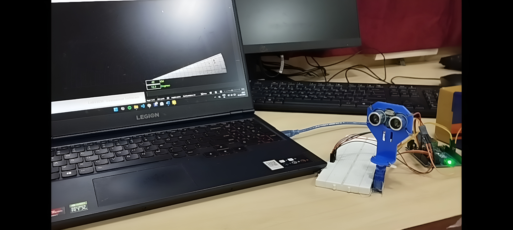

# Ultrasonic-Surveillance-System-using-LabVIEW-and-Arduino-Uno
This mini project was done for (ELE 3241)Measurements &amp; Instrumentation Lab in Jan - Apr 2025.
## Demo

  

## Hardware Setup

  
  &nbsp;&nbsp;&nbsp;
  

  <b>Experimental Setup</b>
  &nbsp;&nbsp;&nbsp;&nbsp;&nbsp;&nbsp;&nbsp;&nbsp;&nbsp;&nbsp;&nbsp;&nbsp;&nbsp;&nbsp;&nbsp;&nbsp;&nbsp;&nbsp;&nbsp;&nbsp;
  <b>HC-SR04 Sensor</b>

